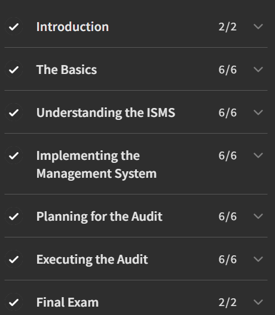

# 🛡️ ISO/IEC 27001:2022 Lead Auditor – Mastermind Assurance

This repository contains structured notes, labs, case studies, reports, and the certificate of completion for the **ISO/IEC 27001:2022 Lead Auditor** training provided by *Mastermind Assurance*.  
It is designed as a **comprehensive reference** for professionals aiming to understand and conduct ISMS audits aligned with ISO 27001 requirements.  

---

## 📚 Notes (Modules)

- 📄 [`01-introduction.md`](./notes/01-introduction.md) – Introduction to ISO/IEC 27001  
- 📄 [`02-iso27001-overview.md`](./notes/02-iso27001-overview.md) – Standard structure & overview  
- 📄 [`03-lead-auditor-role.md`](./notes/03-lead-auditor-role.md) – Responsibilities of Lead Auditors  
- 📄 [`04-clauses.md`](./notes/04-clauses.md) – Clauses of ISO/IEC 27001:2022  
- 📄 [`05-annex-a-controls.md`](./notes/05-annex-a-controls.md) – Annex A security controls  
- 📄 [`06-audit-phases.md`](./notes/06-audit-phases.md) – Audit process phases  
- 📄 [`07-nonconformities.md`](./notes/07-nonconformities.md) – Nonconformity handling  
- 📄 [`08-references.md`](./notes/08-references.md) – Standards & references  

---

## 🧪 Labs

- 🧩 [`incident-response-lab.md`](./labs/incident-response-lab.md) – Incident handling during audits  
- 🧩 [`internal-audit-lab.md`](./labs/internal-audit-lab.md) – Conducting an internal audit  
- 🧩 [`policy-gap-analysis-lab.md`](./labs/policy-gap-analysis-lab.md) – Gap analysis vs ISO 27001  
- 🧩 [`risk-assessment-lab.md`](./labs/risk-assessment-lab.md) – Risk identification & treatment  

---

## 📂 Documentation

- 📑 [`syllabus.md`](./docs/syllabus.md) – Training syllabus overview  
- 🛠️ [`roadmap.md`](./docs/roadmap.md) – Suggested study roadmap  
- 📖 [`glossary.md`](./docs/glossary.md) – Key ISO/IEC 27001 terms  
- 📚 [`references.md`](./docs/references.md) – References & further reading  

---

## 📊 Extras

- 🕒 [`timeline.md`](./extras/timeline.md) – Timeline of ISO/IEC 27001 evolution  
- 📂 [`case-studies.md`](./extras/case-studies.md) – Real-world audit case studies  
- 📘 [`resources.md`](./extras/resources.md) – Extended resources for Lead Auditors  

---

## 📝 Reports

- 🗂️ [`audit_plan.md`](./report/audit_plan.md) – Audit plan template  
- 📋 [`audit_report.md`](./report/audit_report.md) – Audit report template  
- ⚠️ [`nonconformity_report.md`](./report/nonconformity_report.md) – Nonconformity reporting form  
- ✅ [`corrective_action_plan.md`](./report/corrective_action_plan.md) – Corrective action planning  

---

## 📸 Screenshots

| Content        | Screenshot |
|----------------|------------|
| 🎓 Course View |  |

---

## 📜 Certificate

🎓 [`Nguyen Vu Thanh Danh – ISO/IEC 27001:2022 Lead Auditor`](./cert/Nguyen%20Vu%20Thanh%20Danh%20-%202025-09-13.pdf)

---

## 📝 Reflections

> Key takeaways after completing this training:

- **Strengths**: The course provides a rigorous understanding of ISO/IEC 27001:2022 clauses, Annex A controls, and the end-to-end audit process.  
- **Challenges**: Writing audit reports and identifying nonconformities required detailed knowledge of organizational ISMS practices.  
- **Practical Relevance**: Highly valuable for consultants, auditors, and ISMS managers implementing or maintaining ISO 27001 certification.  
- **Most impressive part**: Hands-on labs simulating real internal audits and gap analyses.  
- **My own growth**: Improved confidence in conducting audits, handling nonconformities, and preparing professional audit documentation.  

---

## ✍️ Author

**Thành Danh** – Red Team Learner & Security Researcher  

- GitHub: [@ngvuthdanhh](https://github.com/ngvuthdanhh)  
- Email: ngvu.thdanh@gmail.com  

---

## 📄 License

This project is licensed under the terms of the **MIT License**.  
See [`LICENSE`](./LICENSE) for details.

© 2025 ngvuthdanhh. All rights reserved.
